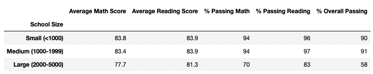

# School District Analysis

## Overview
A school board requested an analysis of local high schools. The primary measure of a school's success was math and reading scores to inform high and low performing schools, and compare average scores by grade, school spending, student population size, and school type.

## Process
An [original analysis](PyCitySchools.ipynb) was completed with the Pandas Library in Jupyter notebooks. I merged the supplied raw school and student .csv data, inspected and cleansed the data, and sorted, grouped, and summarized the data into dataframes. After the initial analysis was complete, the school board was notified of academic dishonesty for 9th grade reading and math at Thomas High School (THS). I replaced the scores of the dishonest grades at THS and updated the data analysis. The results below compare the original analysis to the [updated analysis](PyCitySchools_Challenge.ipynb) to show the impact of these fradulent grades.

## Results
### How is the district summary affected?
Original District Summary 

Updated District Summary 
Removing the Thomas High School (THS) 9th grade students hardly impacted the district analysis. There were changes to score averages in the tenths of percents. This is not surprising as this subset of data was only 461 of 39170 total students across all schools.
  
### How is the school summary affected?
- Original School Summary 
- Updated School Summary 
The school summary shows more changes in the analysis. There was a slight decrease in the average math score, while the average reading score slightly increased. However, the percentage passing math, reading, and overall passing percentage dropped significantly.

### How does replacing the ninth graders’ math and reading scores affect Thomas High School’s performance relative to the other schools?
With the original analysis, Thomas High School was ranked 2nd based on overall % passing metrics. After the second analysis, removing 9th grade reading and math scores, THS dropped in ranking down to the eighth position.

### How does replacing the ninth-grade scores affect the following:
  - #### Math and reading scores by grade
    - Original Math Scores 
    - Original Reading Scores 
    - Updated Math Scores 
    - Updated Reading Scores 
    - The two updated screenshots confirm the 9th grade math and reading scores have been replaced with NaNs.
    
  - #### Scores by school spending
    - Original Scores by School Spending 
    - Updated Scores by School Spending 
    - THS spends $638 per student, and therefore falls in the $631-645 bin of bucket spending.
    
  - #### Scores by school size
    - Original Scores by School Size 
    - Updated Scores by School Spending 
    - THS with a size of 1,635 students, and therefore falls in the medium bin of school size.
   
  - #### Scores by school type
    - Original Scores by School Type 
    - Updated Scores by School Type 
    - THS is a charter school.

## Summary
After reading and math scores for the ninth grade at Thomas High School were replaced with NaNs:
1. The overall passing rate for THS dropped more than 25%.
2. THS dropped in rank from 2nd to 8th in the school district.
3. And reporting done by the grade level will show "NaN" for the 9th graders at THS.
4. The most noticeable changes were at the school level analysis, rather than the district level.
